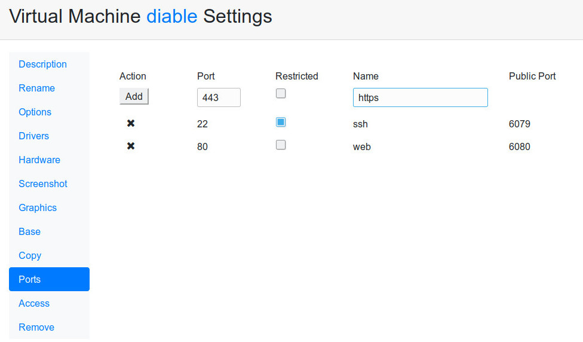
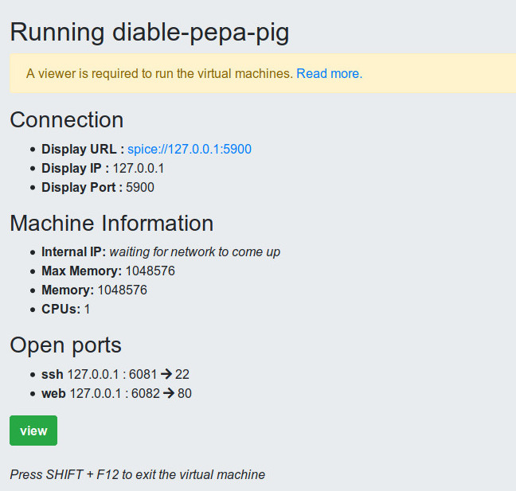

* Administració Avançada
# Administració Avançada
## Part pràctica

---
# Permissos d'usuari

* change_settings: can change the settings of owned virtual machines.
* change_settings_all: can change the settings of any virtual machine.
* change_settings_clones: can change the settings of any virtual machine cloned from one base owned by the user.
* clone: can clone public virtual machines.
* clone_all: can clone any virtual machine.
* create_base: can create bases.
* create_machine: can create virtual machines.
* expose_ports: Can expose virtual machine ports.
* grant: can grant permissions to other users
* manage_users: can manage users.

---
# Permissos d'usuari

* remove: can remove any virtual machine owned by the user.
* remove_all: can remove any virtual machine.
* remove_clones: can remove clones from virtual machines owned by the user.
* remove_clone_all: can remove any clone.
* rename: Can rename any virtual machine owned by the user.
* rename_all: Can rename any virtual machine.
* rename_clones: Can rename clones from virtual machines owned by the user.
* screenshot: Can get a screenshot of own virtual machines.
* shutdown: Can shutdown own virtual machines.
* shutdown_all: can shutdown any virtual machine.
* shutdown_clones: can shutdown clones from virtual machines owned by the user.
* start_many: Can have more than one machine started.

---
# Storage Pools

* Default
* Base
* Clons

https://ravada.readthedocs.io/en/latest/docs/advanced_settings.html#choosing-storage-pool

---
# Accés anònim
## Mode kiosk

* La màquina es destrueix en shutdown
* Es permet per xarxa
* No GUI : base de dades

https://ravada.readthedocs.io/en/latest/docs/Kiosk_mode.html

---
# Gestió de màquina

* Descripció
* Nom

---
# Gestió de màqina

* Drivers
* Graphics

---
# Gestió de màqina
## Screenshot

Permet ficar el Screenshot per la plana principal

---
# Gestió de màqina
## Copiar

Es pot copiar la màquina i generar N clons

* Copiar base: genera clon
* Copiar clon: fa un clon idèntic

---
# Restriccions d'accés

Es pot restringir l'accés per LDAP

---
# Exposar Ports

Redirigeix ports interns de la màquina virtual

* Accés a serveis ( web , ssh , ... )
* Accés per x2go
* Accés per Windows Remote Desktop

---
## Exposar Ports - Configurar

---
## Exposar Ports - Veure

---
# Nodes
## Creació de granges de servidors

https://ravada.readthedocs.io/en/latest/docs/nodes.html

---
# Nodes
## Non-shared storage

Els volums es sincronitzen per la xarxa

---
# Nodes
## Shared Storage

---
# Set Hostname

Donar nom a la màquina clonada

`  dmidecode | grep hostname`

https://ravada.readthedocs.io/en/latest/docs/set_hostname.html

---
Links
# URLs
- https://ravada.upc.edu
- https://github.com/UPC/ravada
- https://ravada.readthedocs.io
- https://infoteleco.upc.edu/ravada
- https://twitter.com/ravada_vdi
- https://libvirt.org/apps.html#web
- https://pkgs.org/download/ravada
- https://www.spinics.net/lists/fedora-package-announce/msg235802.html
- https://www.spice-space.org/download.html

---
Agraïments
<!-- .slide: data-background-image="img/mindmap.jpg" -->
