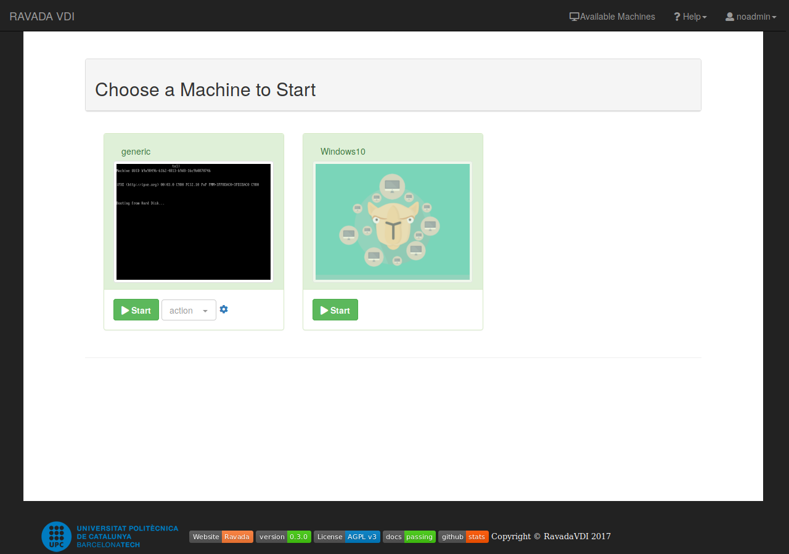
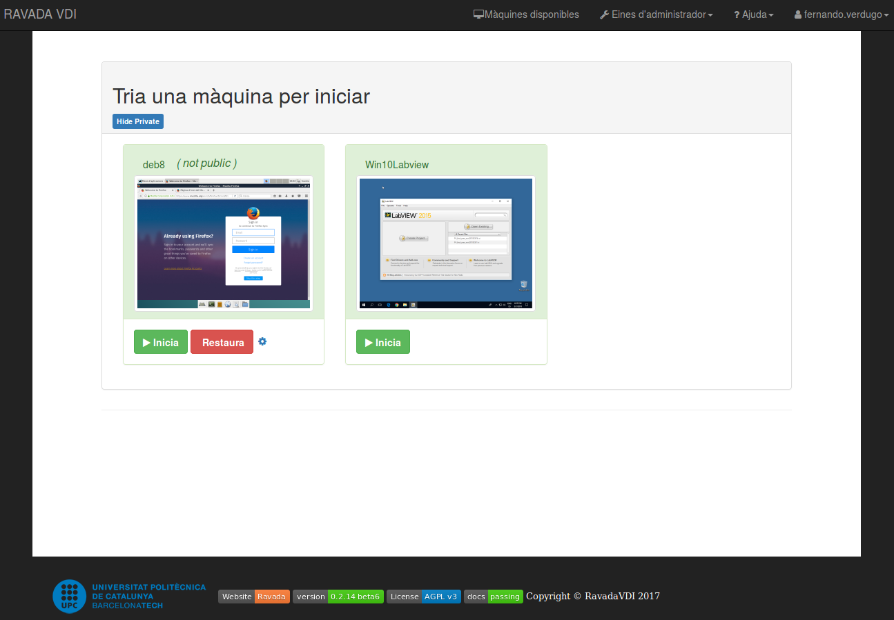
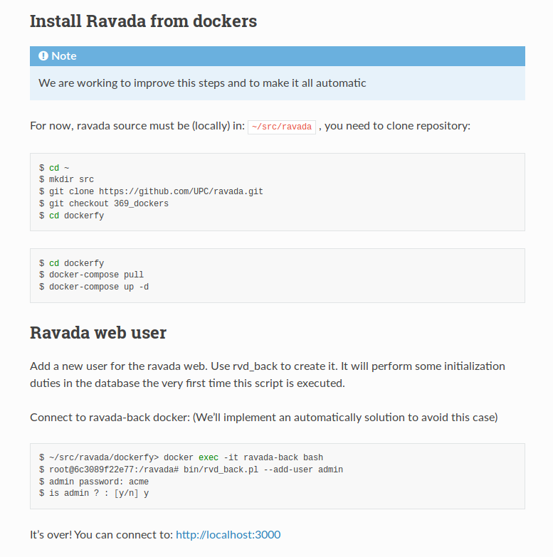

## Features:
### Manage Nodes (Scalability)
### Internationalization & Location (I18N)
### LDAP Authentication, ACLs
### Config mode (ephimeral/volatile, kiosk)
### Test-Driven Development (TDD) > 1000 tests
### Releases and deb & rpm packages

---
Rols

### user role
Rol user

---
### admin role

Rol admin

---
<!-- .slide: data-background-color="#E8F3E8" -->
* Dockers

## Deploy Ravada from Dockers

---
docker-compose
docker-compose

---
Install from dockers

