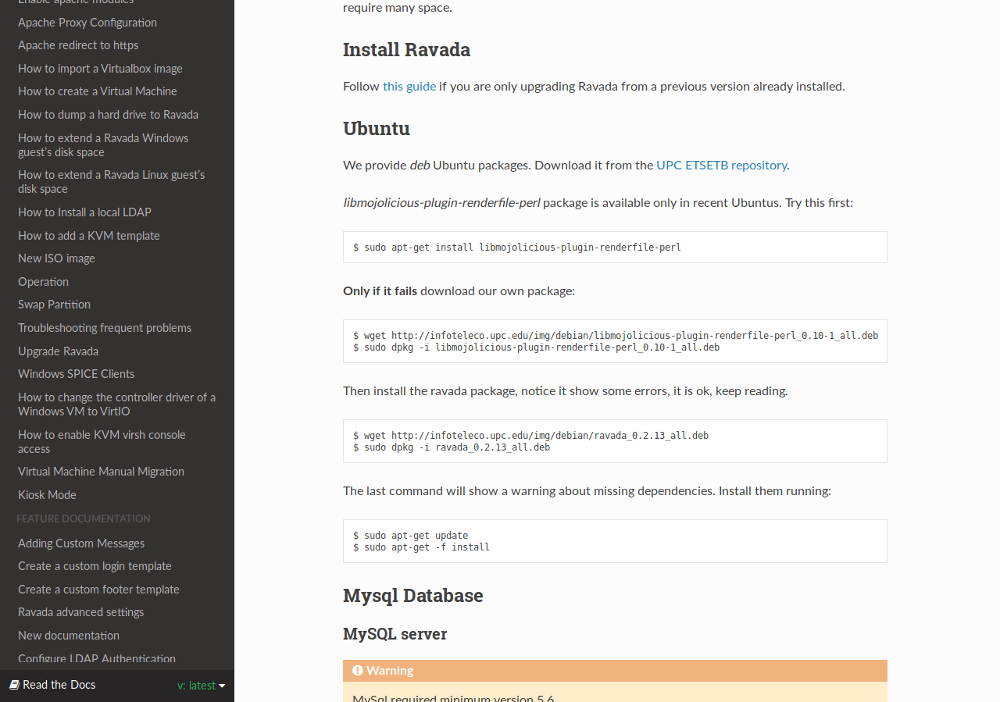
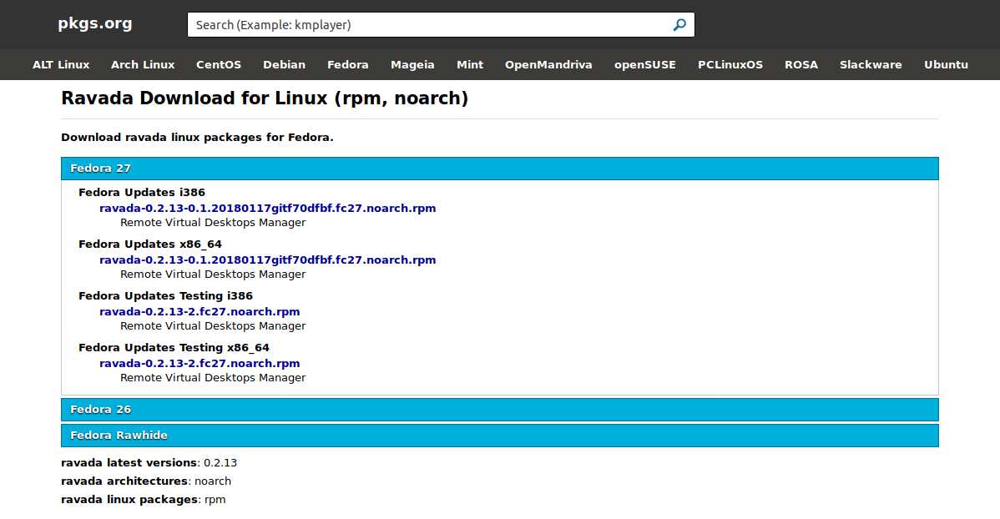

<!-- .slide: data-background-color="#f7cac9" -->
* INSTAL·LACIÓ
# Instal·lació
## Part pràctica

---
Manual instal·lació

---
Paquets .deb

Creem paquets debian per a una fàcil instal·lació

---
Gràcies a <a href="https://github.com/eclipseo" target="blank_">@eclipseo</a>

Paquets .rpm

